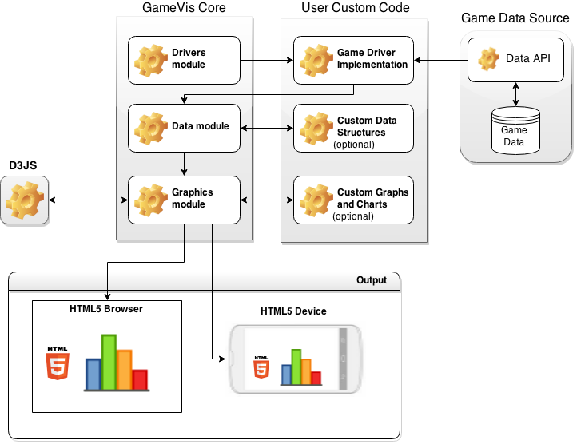

GameVis
=======

---

#### Competitive Game Visualization API in Javascript and HTML5.

### Features

-	Displays competitive game data in HTML5 based dynamic charts.
-	Driver structure that enables the adaptation of any kind of game data to GameVis game data.
-	Has a customizable chart system to allow the user to customize every parameter of the bundled charts.
-	Portable and easy-to-learn code and structure.
-	Uses the power and flexibility of RequireJS and D3JS.
-	Comes with driver implementations and chart rendering examples.

### Architecture

(GameVis Architecture Diagram)

